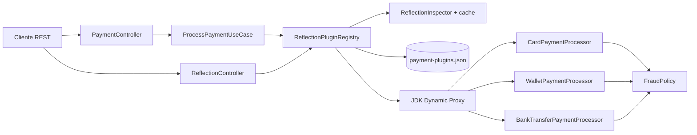

# PoC Java Reflection aplicada a Payment Processing

## 1. Para qué hice esta PoC

Esta PoC está enfocada en **Java Reflection**. El procesamiento de pagos es el contexto funcional que uso para que Reflection tenga un problema real que resolver: registrar procesadores de pago sin acoplar el flujo principal a implementaciones concretas, inspeccionar sus capacidades en runtime y ejecutar el procesador correcto de forma dinámica.

No agregué PostgreSQL, Kafka, MongoDB, Neo4j, Qdrant, KurrentDB, InfluxDB ni Drools porque no son necesarios para demostrar Reflection. Meterlos haría la prueba más grande, pero no probaría mejor el concepto.

La PoC usa Java 25, Spring Boot 4.1.1, Spring Framework 7 administrado por el BOM de Spring Boot y Maven. Spring Boot 4.1 recomienda `spring-boot-starter-webmvc`; por eso no uso el starter `web` antiguo.

## 2. Caso de uso técnico: Reflection

El objetivo técnico es mostrar Reflection con más profundidad que un `Class.forName()` aislado. La implementación cubre:

- carga dinámica de clases con `Class.forName`;
- lectura de annotations en runtime con `@PaymentPlugin`, `@ReflectiveOperation` y `@Sensitive`;
- inspección de modifiers, package, interfaces, constructors, fields y methods;
- introspección de `record` y de sus `RecordComponent`;
- introspección de jerarquías `sealed` y `getPermittedSubclasses()`;
- resolución del tipo genérico de `PaymentProcessor<T>` usando `ParameterizedType`;
- resolución e invocación de constructors con `Constructor.newInstance()`;
- invocación dinámica con `Method.invoke()`;
- uso de `Proxy.newProxyInstance()` e `InvocationHandler` como proxy dinámico del plugin;
- manejo explícito de `InvocationTargetException`;
- caché thread-safe de metadatos reflectivos con `ConcurrentHashMap`;
- métricas simples de hits/misses del caché e invocaciones reflectivas;
- restricciones de seguridad para no permitir cargar clases arbitrarias desde un request;
- detección de campos/componentes marcados como sensibles sin leer ni devolver su valor.

### Decisión importante

El cliente REST **no envía un nombre de clase**. El catálogo de clases está controlado por la aplicación y además existe una allowlist de paquete (`pe.axiz.reflectionpoc.infrastructure.plugin`). Esto evita convertir Reflection en una puerta para instanciar o ejecutar clases arbitrarias.

## 3. Caso de uso funcional

El microservicio procesa pagos simulados por tres medios:

1. tarjeta;
2. billetera digital;
3. transferencia bancaria.

Cada medio tiene un plugin que implementa `PaymentProcessor<T>`. El tipo `T` indica el instrumento que procesa. El registro reflectivo lee el tipo genérico en runtime, valida el plugin, construye la instancia y luego el caso de uso invoca el procesador correspondiente sin hacer `new CardPaymentProcessor(...)`, `new WalletPaymentProcessor(...)`, etc. en el flujo de aplicación.

No intento simular un gateway de pagos real. El procesamiento es intencionalmente simple porque el foco es la mecánica de Reflection.

## 4. Arquitectura



La estructura sigue DDD + hexagonal de forma pragmática:

- `domain`: modelo, contracts, annotations y regla de dominio que no dependen de Spring;
- `application`: caso de uso que orquesta el procesamiento;
- `infrastructure`: adapters REST, plugins concretos y motor de Reflection;
- el flujo depende de `PaymentProcessor<T>` como puerto y no de los procesadores concretos.

## 5. Estructura del proyecto

```text
.
├── datasets/                         catálogo editable y script de carga
├── infrastructure/                   Docker, compose, requests y ejemplos request/response
├── src/main/java/pe/axiz/reflectionpoc/
│   ├── application/                  casos de uso
│   ├── domain/                       modelo, puertos, annotations y reglas
│   └── infrastructure/               REST, Reflection y plugins
├── src/main/resources/               configuración y dataset empaquetado
├── src/test/                          pruebas del caso técnico
├── pom.xml                            build Maven para Java 25
└── README.md                          toda la documentación de la PoC
```

## 6. Código principal

### `ReflectionPluginRegistry`

Es el corazón de la PoC. Lee el catálogo, carga cada clase, valida `PaymentProcessor`, lee `@PaymentPlugin`, resuelve `PaymentProcessor<T>`, encuentra el constructor permitido, instancia el plugin, crea un proxy dinámico y conserva los `Method` necesarios para ejecutar el pago.

No hace scanning general de classpath a propósito. Quiero que el origen de plugins sea explícito, reproducible y controlable.

### `ReflectionInspector`

Extrae metadatos de cualquier clase interna permitida y los guarda en caché. También reconoce records, sealed types, annotations, campos sensibles, generic interfaces y componentes de records.

### `PaymentProcessor<T>`

Es el puerto del dominio. El parámetro genérico no es decorativo: `ReflectionPluginRegistry` lo inspecciona para saber qué tipo de instrumento admite cada implementación.

### Dynamic Proxy

Cada plugin se expone internamente mediante `Proxy.newProxyInstance`. Así se demuestra el uso de proxies JDK construidos en runtime. La implementación real sigue estando detrás del contrato `PaymentProcessor`.

## 7. Dataset

El archivo editable está en:

```text
datasets/payment-plugins.json
```

Su contenido define las clases que el registro intentará cargar:

```json
{
  "plugins": [
    "pe.axiz.reflectionpoc.infrastructure.plugin.CardPaymentProcessor",
    "pe.axiz.reflectionpoc.infrastructure.plugin.WalletPaymentProcessor",
    "pe.axiz.reflectionpoc.infrastructure.plugin.BankTransferPaymentProcessor"
  ]
}
```

Después de cambiarlo ejecuto:

```bash
./datasets/load-dataset.sh
```

Eso copia el catálogo a `src/main/resources/datasets/payment-plugins.json`, que es el que se empaqueta en el JAR.

No uso Flyway porque no existe una base de datos en esta PoC y por lo tanto no hay migraciones ni carga SQL que gestionar.

## 8. Endpoints en el orden en que los probaría

| Orden | Método | Endpoint | Descripción funcional | Qué demuestra técnicamente |
|---:|---|---|---|---|
| 1 | GET | `/api/v1/reflection/plugins` | Lista procesadores disponibles | annotations, genéricos, constructors y catálogo dinámico |
| 2 | GET | `/api/v1/reflection/plugins/CARD/inspect` | Inspecciona la clase del procesador | methods, fields, modifiers, interfaces y cache de metadata |
| 3 | POST | `/api/v1/payments` | Procesa un pago | selección por metadata, proxy dinámico y `Method.invoke()` |
| 4 | GET | `/api/v1/reflection/metrics` | Consulta métricas de Reflection | cache hits/misses e invocaciones |
| 5 | POST | `/api/v1/reflection/plugins/reload` | Recarga el registro | `Class.forName`, reconstrucción de descriptors y validaciones |
| 6 | GET | `/actuator/health` | Verifica que el servicio esté arriba | endpoint operativo mínimo |

## 9. Levantar con Docker Compose

Esta PoC no necesita servicios externos. El compose solo construye y ejecuta el microservicio con Java 25.

Desde la raíz:

```bash
cd infrastructure
docker compose up --build
```

No uso `-d` para que el arranque y los logs sean visibles. Tampoco definí un healthcheck de Docker que haga requests periódicos, así los logs no se llenan con llamadas de liveness.

Para detenerlo:

```bash
docker compose down
```

## 10. Ejecutar localmente

Requisitos:

- JDK 25;
- Maven 3.9.16 o compatible.

Compilo y pruebo:

```bash
mvn clean verify
```

Ejecuto:

```bash
mvn spring-boot:run
```

También puedo construir el JAR:

```bash
mvn clean package
java -jar target/reflection-payment-poc-1.0.0.jar
```

## 11. Pruebas por curl

### Test 1: ver qué plugins fueron cargados

```bash
curl -s http://localhost:8080/api/v1/reflection/plugins
```

Con esto verifico que el servicio pudo cargar las clases del catálogo, leer `@PaymentPlugin`, resolver el tipo genérico y construir su descriptor.

### Test 2: inspeccionar un plugin

```bash
curl -s http://localhost:8080/api/v1/reflection/plugins/CARD/inspect
```

Aquí veo la información que Reflection obtiene de la clase: constructors, methods, fields, interfaces, annotations y generic interfaces.

### Test 3: procesar pago con tarjeta

```bash
curl -s -X POST http://localhost:8080/api/v1/payments \
  -H 'Content-Type: application/json' \
  -d '{
    "paymentId":"PAY-1001",
    "amount":125.50,
    "currency":"PEN",
    "instrumentType":"CARD",
    "pan":"4111111111111111",
    "cardHolder":"Cliente Demo",
    "expiryMonth":12,
    "expiryYear":2030,
    "cvv":"123"
  }'
```

Este es el test central. El controller convierte el request a `CardPayment`; el caso de uso pide ejecutar `CARD`; el registro usa el plugin ya descubierto y llama a `supports` y `process` mediante Reflection/proxy. El response nunca devuelve PAN ni CVV completos.

### Test 4: procesar billetera

```bash
curl -s -X POST http://localhost:8080/api/v1/payments \
  -H 'Content-Type: application/json' \
  -d '{
    "paymentId":"PAY-1002",
    "amount":80.00,
    "currency":"PEN",
    "instrumentType":"WALLET",
    "walletProvider":"YAPE-DEMO",
    "walletToken":"tok_demo_123"
  }'
```

Esto prueba que el registro puede manejar otra implementación y otro parámetro genérico sin modificar `ProcessPaymentUseCase`.

### Test 5: mirar el efecto del cache

```bash
curl -s http://localhost:8080/api/v1/reflection/plugins/CARD/inspect
curl -s http://localhost:8080/api/v1/reflection/plugins/CARD/inspect
curl -s http://localhost:8080/api/v1/reflection/metrics
```

La segunda inspección debe incrementar los hits del cache. La intención es mostrar que la metadata reflectiva no debería recalcularse en cada request en un servicio productivo.

### Test 6: recargar plugins

```bash
curl -s -X POST http://localhost:8080/api/v1/reflection/plugins/reload
```

La recarga vuelve a leer el catálogo, valida clases, annotations, genéricos y constructors, y reemplaza el registro de forma controlada.

### Test 7: validar rechazo por regla funcional

```bash
curl -s -X POST http://localhost:8080/api/v1/payments \
  -H 'Content-Type: application/json' \
  -d '{
    "paymentId":"PAY-1003",
    "amount":15000.00,
    "currency":"PEN",
    "instrumentType":"CARD",
    "pan":"4111111111111111",
    "cardHolder":"Cliente Demo",
    "expiryMonth":12,
    "expiryYear":2030,
    "cvv":"123"
  }'
```

El pago se rechaza porque `FraudPolicy` limita esta PoC a 10,000.00. La regla existe solo para que el procesador tenga comportamiento funcional observable.

## 12. Buenas prácticas que estoy aplicando

- Reflection queda encapsulada en infraestructura y no contamina el dominio.
- No hay nombres de clase controlados directamente por el consumidor REST.
- Se valida package, interface, annotation, constructor y tipo genérico antes de registrar un plugin.
- No uso `setAccessible(true)` para romper encapsulación. La PoC inspecciona miembros privados, pero no fuerza acceso a sus valores.
- Las excepciones de Reflection se traducen a errores controlados.
- Los datos sensibles se marcan y no se devuelven en responses.
- La metadata se cachea.
- El registro usa estructuras concurrentes.
- Los plugins son intercambiables por contrato y el caso de uso no conoce implementaciones concretas.
- El proyecto evita dependencias de infraestructura que no aportan al concepto.

## 13. Límites intencionales

Esta PoC no pretende demostrar hot deployment de JARs externos, module layers, instrumentation/agents, bytecode generation ni acceso reflectivo profundo a módulos del JDK. Esos son temas relacionados pero distintos y meterlos aquí mezclaría varios casos técnicos.

Tampoco usaría Reflection para todo en un sistema real. La usaría donde existe una necesidad de extensibilidad o metadata dinámica y cachearía los resultados, como hago en esta PoC.
