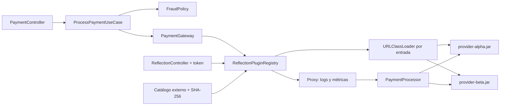

# Java Reflection: Proveedores de pagos externos


## Caso de uso

Se tiene un servicio de pagos al cual se le puede agregar un proveedor nuevo como JAR.
El servicio puede descubrirlo, validar su contrato y capacidades, y procesar pagos con él
sin modificar, recompilar ni reiniciar el servicio principal.

Los proveedores están fuera del JAR de Spring Boot;
el servicio no tiene dependencias Maven de ninguno de ellos. Agregar BETA al reactor raíz facilita
trabajar con el ejemplo, pero no lo convierte en dependencia del servicio.


Stack: Java 25, Spring Boot 4.1.1, Maven 3.9.16 recomendado. Los scripts de instalación y demostración
requieren Python 3.10+ y usan únicamente su biblioteca estándar. No se necesita Python para ejecutar el servicio.

## Cuándo reflection aporta una ventaja

| Registro explícito | Registro de JAR externos |
|---|---|
| El host importa y construye cada proveedor. | El host conoce solamente el contrato compartido. |
| Un proveedor nuevo requiere una dependencia y un cambio de código. | Se instala un JAR y se actualiza un catálogo externo. |
| Hay que recompilar y distribuir el host. | El mismo proceso publica una nueva generación del registro. |
| Más comprobaciones en compilación y menor complejidad. | Requiere validaciones en ejecución y gestionar classloaders. |

El obetivo de la poc es mostrar la **extensibilidad de implementaciones desconocidas al compilar el host**.

Java también ofrece `ServiceLoader` para descubrir proveedores de una SPI. Es una alternativa válida:
esta PoC usa un catálogo explícito para controlar el artefacto, su hash y la clase de entrada, y reflection
para inspeccionar genéricos, anotaciones y constructores. Estos plugins, anotaciones y endpoints son un
diseño de esta aplicación; no son un estándar impuesto por reflection.

Módulos y dependencias

Modulos ALPHA, BETA, service y api

ALPHA y BETA son **dos proveedores ficticios de procesamiento de pagos**, como si fueran dos empresas
con implementaciones diferentes. No son versiones alpha/beta del software ni entornos de despliegue.

Los directorios son **módulos Maven de un mismo repositorio**, no cinco microservicios. Cada módulo genera
su propio JAR, pero **solo `payment-service` levanta un servidor HTTP**. Los proveedores se ejecutan dentro
del mismo proceso Java, sin puertos propios ni llamadas HTTP entre ellos y el servicio.

| Módulo | Responsabilidad | Por qué está separado |
|---|---|---|
| `payment-plugin-api` | Define `PaymentProcessor<T>`, `PaymentGateway`, instrumentos, resultados y anotaciones. | Servicio y proveedores comparten el mismo vocabulario sin depender de implementaciones. |
| `payment-service` | Recibe requests, valida, aplica fraude, descubre proveedores y ejecuta pagos. | Su JAR debe permanecer intacto al incorporar un proveedor. |
| `provider-alpha` | Implementación inicial; acepta tarjeta, billetera y transferencia. | Se entrega como un artefacto independiente del servidor. |
| `provider-beta` | Implementación adicional; acepta tarjeta. | Permite instalar código que el servidor no conocía al compilar. |
| `explicit-example` | Registro manual de ALPHA con `new AlphaPaymentProcessor()`. | Compara el despacho explícito con el dinámico, sin incluir esta dependencia en el servidor. |

API significa aquí contrato compartido de Java; no otro servidor REST. SPI es el contrato que implementa
un proveedor para integrarse: en este proyecto, `PaymentProcessor<T>`.

### Compilacion y ejecucion

```text
Al compilar:
  payment-service -> payment-plugin-api
  provider-alpha -> payment-plugin-api
  provider-beta -> payment-plugin-api
  explicit-example -> provider-alpha + payment-plugin-api

Al ejecutar, dentro de una sola JVM:
  payment-service.jar
    ├── contrato compartido
    ├── registro de proveedores y proxy
    ├── loader externo → alpha-<hash>.jar
    └── loader externo → beta-<hash>.jar (después de instalarlo)
```

El `pom.xml` raíz agrupa los módulos para construirlos juntos. Eso no agrega ALPHA ni BETA
como dependencias de `payment-service`. Si estuvieran empaquetados dentro del servidor, incorporar otro
proveedor normalmente exigiría reconstruir ese servidor: se perdería la ventaja que queremos demostrar.

`mvn -pl provider-beta -am package` selecciona BETA y los módulos que necesita (`payment-plugin-api` y el
POM padre). No selecciona `payment-service`. En un sistema real, BETA podría venir de otro repositorio/equipo.

### Organización del repositorio

```text
payment-plugin-api/   Contratos, instrumentos, resultados y anotaciones; sin Spring
payment-service/      Caso de uso, fraude, REST, registro, inspección y proxy
provider-alpha/       JAR externo: CARD, WALLET y BANK_TRANSFER; PEN y USD
provider-beta/        JAR externo: CARD; PEN y USD
explicit-example/     Comparación ejecutable con registro explícito
datasets/             Definiciones de artefactos para el instalador
scripts/              Instalación y demostración automatizada
infrastructure/       Docker, HTTP requests y ejemplos JSON
runtime/              Catálogo, JAR instalados y evidencias locales (ignorado por Git)
```



El caso de uso depende de `PaymentGateway`, no de infraestructura. Los proveedores dependen únicamente
de `payment-plugin-api`, con scope Maven `provided`: el host proporciona esa API al ejecutar.

`providerCode` identifica quién procesa el pago; `instrumentType` indica cómo se paga.
Ambos proveedores aceptan CARD; agregar otro proveedor para los instrumentos existentes no cambia el mapper.
Agregar un instrumento nuevo sí requiere ampliar el contrato sealed y el mapper: esa extensión no es el objetivo.

## Flujo de Reflection

### Instalación, registro y ejecución

Son tres momentos distintos. Copiar un JAR no basta para empezar a usarlo:

| Momento | Quién lo realiza | Resultado |
|---|---|---|
| Compilación e instalación | Maven y `install_plugins.py` | JAR en disco y catálogo externo actualizado. |
| Descubrimiento y registro | Arranque del servicio o endpoint `reload` | Clases validadas, instancias, proxies y mapa activo en memoria. |
| Procesamiento | `POST /api/v1/payments` | Selección de una instancia ya registrada y ejecución del pago. |

Hay dos JSON con propósitos distintos:

- `datasets/payment-plugins.json` indica al **instalador** dónde encontrar los artefactos compilados.
- `runtime/payment-plugins.json` indica al **servicio** qué JAR externo y clase cargar, y qué hash verificar.

El segundo tiene entradas de esta forma (los textos entre `<...>` representan valores reales generados;
este fragmento es ilustrativo y no se debe copiar como catálogo):

```json
{
  "plugins": [
    {
      "jar": "beta-<sha256>.jar",
      "className": "com.example.beta.BetaPaymentProcessor",
      "sha256": "<64 caracteres hexadecimales>"
    }
  ]
}
```

El código `BETA` no se obtiene del nombre del archivo: se lee de `@PaymentPlugin(code = "BETA", ...)`.
El request de pago envía ese código, nunca el nombre Java de la clase.

### Qué hace el registro al cargar un JAR

1. El registro lee `runtime/payment-plugins.json` al arrancar o durante una recarga administrativa.
2. Valida el nombre del JAR y que su ruta real esté dentro del directorio de plugins.
3. Copia el JAR a un archivo temporal privado de esa generación y comprueba el SHA-256 de esa copia.
   Así no carga bytes distintos de los verificados y no mantiene bloqueado el JAR instalado en Windows.
4. Crea un `URLClassLoader` cuyo padre conoce `payment-plugin-api`.
5. Ejecuta `Class.forName(className, false, loader)`: carga la clase sin inicializarla todavía.
6. Comprueba que la clase viene del cargador externo, es pública y concreta e implementa `PaymentProcessor`.
7. Lee `@PaymentPlugin` en runtime: código, versión de SPI, instrumentos, monedas y prioridad.
8. Mediante `ParameterizedType`, resuelve el argumento de `PaymentProcessor<T>` y comprueba que las
   capacidades declaradas son compatibles con él.
9. Obtiene el constructor público sin argumentos con `getConstructor()` y crea la instancia con
   `Constructor.newInstance()`. No fuerza acceso privado.
10. Construye un proxy JDK que intercepta `process`, mide tiempo y registra el resultado. El handler
    delega usando `Method.invoke` y extrae la causa de `InvocationTargetException`.
11. Publica un mapa inmutable completo cuando todos los plugins son válidos.

Después del descubrimiento, el registro redirecciona a través de una llamada normal a `PaymentProcessor`.
No vuelve a buscar constructores ni métodos en cada pago. La invocación reflectiva del proxy sirve para
delegar una operación interceptada; la ventaja de extensibilidad está en el descubrimiento y la carga.

La prioridad ordena el listado; no selecciona proveedores ni implementa failover.
`@ReflectiveOperation` documenta métodos en el descriptor; no genera rutas HTTP ni autoriza métodos arbitrarios.


### Flujo de pago BETA

Supongamos que BETA ya está registrado y llega un request con `providerCode: "BETA"`, `instrumentType: "CARD"`
y un importe de 125.50 PEN:

1. `PaymentController` recibe el JSON. Bean Validation comprueba los campos obligatorios y sus formatos.
2. `PaymentMapper` valida los datos del instrumento y crea un `CardPayment` dentro de un `PaymentCommand`.
   Esta transformación está escrita explícitamente; no usa reflection.
3. `ProcessPaymentUseCase` aplica `FraudPolicy`. Si el importe supera 10,000.00, responde `REJECTED` aquí
   mismo y no busca ni invoca un proveedor.
4. El caso de uso llama a `PaymentGateway`, el puerto que implementa `ReflectionPluginRegistry`.
5. El registro busca `BETA` en el mapa activo. Si no existe, la API responde 404.
6. Comprueba que `CardPayment` corresponde al tipo genérico descubierto al cargar BETA y que CARD/PEN
   están entre sus capacidades. Una incompatibilidad en este punto produce 400.
7. Llama a `supports` y luego a `process` sobre el proxy. Un `supports` que rechaza una capacidad que el
   plugin declaró compatible se trata como un fallo del proveedor (502), no como un error del request.
8. El proxy registra el inicio, usa `Method.invoke` para delegar al objeto BETA y mide cuánto tarda.
9. BETA devuelve `APPROVED`, salvo que el PAN termine en `0000`, en cuyo caso devuelve `REJECTED`.
10. El proxy registra el resultado y actualiza métricas. El controller devuelve el `PaymentResult` como JSON.

```text
JSON → controller → mapper → caso de uso → fraude
                                         ↓ permitido
                                  PaymentGateway
                                         ↓
                      registro["BETA"] → validar capacidades
                                         ↓
                                 proxy → instancia BETA
                                         ↓
                            PaymentResult → respuesta JSON
```

No se vuelve a leer el catálogo ni se crea un proveedor en cada pago. La instancia se reutiliza hasta
la siguiente recarga. `providerCode` decide quién procesa; `instrumentType` decide qué instrumento recibe.

## Contrato de un proveedor externo

```java
@PaymentPlugin(
    code = "BETA",
    description = "Proveedor externo especializado en tarjetas",
    instruments = {"CARD"},
    currencies = {"PEN", "USD"},
    apiVersion = 1
)
public final class BetaPaymentProcessor implements PaymentProcessor<CardPayment> {
    public BetaPaymentProcessor() {}

    public boolean supports(PaymentInstrument instrument) {
        return instrument instanceof CardPayment;
    }

    public PaymentResult process(PaymentCommand command, CardPayment instrument) {
        // Implementación del proveedor
    }
}
```

Requisitos de SPI v1:

- Clase pública y concreta, con constructor público sin argumentos.
- Declarar directamente `PaymentProcessor<CardPayment>`, otro instrumento concreto o `PaymentInstrument`.
  La PoC rechaza genéricos raw y no resuelve cadenas de herencia genérica.
- Código único, anotación presente, versión de API 1, capacidades no vacías y monedas ISO válidas.
- Instancia thread-safe. Constructor sin efectos externos. Sin hilos, conexiones ni recursos propios que
  exijan un ciclo de vida adicional: la SPI v1 no tiene callbacks de cierre de proveedores.
- JAR autocontenido salvo la API compartida. No empaquetar clases de `pe.axiz.reflectionpoc` ni declarar
  `Class-Path` en el manifest. Bibliotecas adicionales requerirían una estrategia de empaquetado explícita.
- Devolver un resultado con el mismo paymentId, código de proveedor y un estado válido.
- No incluir credenciales en resultados ni en logs propios.

`apiVersion` permite rechazar versiones declaradas incompatibles; no sustituye una estrategia completa
de compatibilidad binaria. Los errores de linkage también se controlan.

## Ejecución local

Desde la raíz, con `JAVA_HOME` y `PATH` apuntando a JDK 25:

```bash
mvn clean verify
python scripts/install_plugins.py --providers ALPHA
```

En Linux/macOS 

```bash
export PLUGIN_ADMIN_TOKEN='demo-local-cambiar'
java -jar payment-service/target/payment-service-1.0.0.jar
```

| Variable | Valor predeterminado | Uso |
|---|---|---|
| `PLUGIN_DIRECTORY` | `./runtime/plugins` | Directorio de artefactos confiables |
| `PLUGIN_CATALOG` | `./runtime/payment-plugins.json` | Catálogo externo |
| `PLUGIN_ADMIN_TOKEN` | vacío | Habilita y protege los endpoints de reflection |

Sin token configurado, los endpoints administrativos devuelven 503. Con token incorrecto o ausente,
devuelven 401. Usa `Authorization: Bearer <token>`. La API de pagos permanece abierta para la demo local.

## Flujo de pago BETA

### Automática

```bash
python scripts/verify_external_plugins.py
```

El script:

1. Construye únicamente el servicio, la API y ALPHA.
2. Guarda el hash del JAR del servicio e instala solo ALPHA.
3. Arranca el servicio en un puerto local libre y comprueba que BETA devuelve 404.
4. Construye BETA con `-pl provider-beta -am`, sin incluir `payment-service`.
5. Instala BETA, publica el catálogo y llama a reload.
6. Procesa un pago BETA aprobado y uno rechazado.
7. Comprueba fraude, caché, métricas y preservación del registro ante un hash incorrecto.
8. Verifica que el hash del servicio no cambió y que sigue siendo el mismo proceso.
9. Guarda `verification.json` y `service.log` en `runtime/verification-*/` y detiene su proceso.


Si quieres construir BETA realmente después del arranque, comienza con:

```bash
mvn -pl payment-service,provider-alpha -am package
python scripts/install_plugins.py --providers ALPHA
```

Arranca el servicio como en la sección anterior. En otra terminal:

```bash
mvn -pl provider-beta -am package
python scripts/install_plugins.py --providers ALPHA BETA
curl -X POST http://localhost:8080/api/v1/reflection/plugins/reload \
  -H "Authorization: Bearer demo-local-cambiar"
```

El instalador conserva JARs con nombres basados en su hash y reemplaza el catálogo de forma atómica.
Solo instala proveedores ya compilados: no descarga ni ejecuta código remoto.
El SHA-256 generado identifica los bytes instalados; **no certifica quién los publicó**.

## Pruebas

### Preparación


```bash
python scripts/install_plugins.py --providers ALPHA
```

Arranca el servicio con `PLUGIN_ADMIN_TOKEN=demo-local-cambiar` según tu shell (sección 6).
Deja esa terminal abierta para observar logs; ejecuta los curls en otra terminal.
Los comandos asumen el puerto 8080 y el catálogo predeterminado `runtime/payment-plugins.json`.
Si usas rutas o token distintos, ajústalos también en los ejemplos.

- `-sS` oculta la barra de progreso y muestra errores de conexión.
- `-i` incluye la línea HTTP y los headers: permite distinguir 200, 400, 404 y 409.
- Los JSON de salida mostrados son **fragmentos de los campos relevantes**, salvo que se indique lo contrario.
- `processedAt`, hashes y duración varían. El orden de propiedades JSON no importa.
- Las métricas son acumulativas; los números exactos indicados suponen que no repites pagos ni haces llamadas adicionales.
- Los pagos son simulados. Repetir un paymentId vuelve a ejecutar el pago: no hay idempotencia.

Los payloads están en [infrastructure/examples](infrastructure/examples).
Por ejemplo, [payment-beta.json](infrastructure/examples/payment-beta.json) contiene:

```json
{
  "paymentId": "PAY-2001",
  "providerCode": "BETA",
  "amount": 125.5,
  "currency": "PEN",
  "instrumentType": "CARD",
  "pan": "4111111111111111",
  "cardHolder": "Cliente Demo",
  "expiryMonth": 12,
  "expiryYear": 2030,
  "cvv": "123"
}
```

Mapa de pruebas:

| Caso | Qué compruebas | HTTP esperado |
|---|---|---|
| 1 | Servicio disponible | 200 |
| 2 | Administración requiere token | 401 |
| 3–4 | Catálogo activo y metadatos de ALPHA | 200 |
| 5–6 | Caché vacía, miss y hit de inspección | 200 |
| 7–9 | Tarjeta, billetera y transferencia con ALPHA | 200 / APPROVED |
| 10 | BETA todavía no está registrado | 404 |
| 11–12 | Carga externa, genéricos e incorporación de BETA | 200 |
| 13–14 | Pago BETA aprobado y rechazado | 200 |
| 15 | Fraude impide ejecutar el proveedor | 200 / REJECTED |
| 16–18 | Instrumento, moneda o request incompatibles | 400 |
| 19–20 | Métricas y efecto de una recarga válida | 200 |
| 21–23 | Hash incorrecto, clase inexistente y código duplicado | 409 |
| 24 | Retirar y volver a incorporar BETA | 200, después 404, después 200 |

### Caso 1. Confirmar que el servicio está disponible

```bash
curl -sS -i http://localhost:8080/actuator/health
```

**Esperado:** HTTP 200 y `{"status":"UP"}`.

**Qué demuestra:** disponibilidad del servidor. Este endpoint no ejecuta un pago ni inspecciona plugins.
Si hay `Connection refused`, revisa primero el arranque, puerto, JDK y catálogo; no es una respuesta del motor de reflection.

### Caso 2. Comprobar el acceso administrativo

Sin token:

```bash
curl -sS -i http://localhost:8080/api/v1/reflection/plugins
```

**Esperado:** HTTP 401 y `detail: "Credenciales administrativas requeridas"`.

**Qué demuestra:** no cualquier consumidor de pagos puede inspeccionar o recargar clases.
Si recibes 503 con `Administración deshabilitada: configure PLUGIN_ADMIN_TOKEN`, el servidor arrancó sin token:
configura la variable en la terminal del servidor y reinícialo antes de continuar.
La API `/payments` está abierta para esta demo local.

### Caso 3. Listar los proveedores que realmente están en memoria

```bash
curl -sS -i http://localhost:8080/api/v1/reflection/plugins -H "Authorization: Bearer demo-local-cambiar"
```

**Esperado:** HTTP 200, array con **un solo elemento**, cuyo `code` es `ALPHA`.
Entre sus campos:

```json
[
  {
    "code": "ALPHA",
    "apiVersion": 1,
    "className": "com.example.alpha.AlphaPaymentProcessor",
    "genericInstrumentType": "pe.axiz.reflectionpoc.domain.model.PaymentInstrument",
    "instruments": ["CARD", "WALLET", "BANK_TRANSFER"],
    "currencies": ["PEN", "USD"]
  }
]
```

**Qué demuestra:** el arranque ya cargó el JAR, leyó su anotación, resolvió el genérico y construyó su instancia.
El endpoint lista el registro **activo**, no todos los JAR que encuentre en disco.
Esta consulta no incrementa hits/misses de inspección.

### Caso 4. Consultar el descriptor y entender de dónde sale cada campo

```bash
curl -sS -i http://localhost:8080/api/v1/reflection/plugins/ALPHA -H "Authorization: Bearer demo-local-cambiar"
```

**Esperado:** HTTP 200 y un objeto, no un array.

| Campo | Valor o significado esperado | Origen |
|---|---|---|
| `code` | `ALPHA` | `@PaymentPlugin` |
| `description`, `priority`, `apiVersion` | Descripción, 10, 1 | `@PaymentPlugin` |
| `instruments`, `currencies` | Capacidades del caso 3 | `@PaymentPlugin` |
| `jar`, `sha256` | Nombre instalado y hash real | Artefacto validado |
| `className` | `com.example.alpha.AlphaPaymentProcessor` | Clase cargada |
| `genericInstrumentType` | `...PaymentInstrument` | `PaymentProcessor<PaymentInstrument>` |
| `constructors` | Incluye `public com.example.alpha.AlphaPaymentProcessor()` | Inspección de constructores |
| `reflectiveMethods` | Incluye `process -> Autoriza un pago simulado en ALPHA` | `@ReflectiveOperation` |

**Qué demuestra:** no son datos escritos en el controller para ALPHA; se construyeron inspeccionando su clase.
El descriptor se prepara al registrar el plugin y esta consulta lo reutiliza.

### Caso 5. Ver las métricas antes de inspeccionar o pagar

```bash
curl -sS -i http://localhost:8080/api/v1/reflection/metrics -H "Authorization: Bearer demo-local-cambiar"
```

**Esperado en un arranque limpio:**

```json
{
  "metadataCacheHits": 0,
  "metadataCacheMisses": 0,
  "cachedClasses": 0,
  "generation": 1,
  "providers": {}
}
```

**Qué demuestra:** el arranque constituye la generación 1. Registrar plugins no llena la caché del inspector.
`providers` está vacío porque aún no se ejecutó ningún `process`; no significa que falten proveedores registrados.

### Caso 6. Inspeccionar ALPHA dos veces y comprobar miss/hit

Ejecuta los dos curls:

```bash
curl -sS -i http://localhost:8080/api/v1/reflection/plugins/ALPHA/inspect -H "Authorization: Bearer demo-local-cambiar"
curl -sS -i http://localhost:8080/api/v1/reflection/plugins/ALPHA/inspect -H "Authorization: Bearer demo-local-cambiar"
curl -sS -i http://localhost:8080/api/v1/reflection/metrics -H "Authorization: Bearer demo-local-cambiar"
```

**Esperado:** ambas inspecciones devuelven HTTP 200 y la misma estructura. Fragmento:

```json
{
  "className": "com.example.alpha.AlphaPaymentProcessor",
  "packageName": "com.example.alpha",
  "modifiers": "public final",
  "record": false,
  "sealed": false,
  "fields": [],
  "recordComponents": [],
  "genericInterfaces": [
    "pe.axiz.reflectionpoc.domain.port.PaymentProcessor<pe.axiz.reflectionpoc.domain.model.PaymentInstrument>"
  ]
}
```

También aparecen `constructors`, `methods`, `interfaces`, `annotations` y `permittedSubclasses`.
Los campos vacíos no son un error: ALPHA no tiene campos propios, no es un record y no es sealed.

**Métricas esperadas:** `metadataCacheMisses: 1`, `metadataCacheHits: 1`, `cachedClasses: 1`.

**Qué demuestra:** la primera llamada construye los metadatos; la segunda reutiliza el resultado.
Se inspecciona `AlphaPaymentProcessor`, no los datos de una tarjeta.

### Caso 7. Procesar una tarjeta con ALPHA

```bash
curl -sS -i -X POST http://localhost:8080/api/v1/payments -H "Content-Type: application/json" --data-binary "@infrastructure/examples/payment-request.json"
```

**Esperado:** HTTP 200 y:

```json
{
  "paymentId": "PAY-1001",
  "processor": "ALPHA",
  "status": "APPROVED",
  "details": {"last4": "1111"}
}
```

Además, `processedAt` tendrá el instante de ejecución.
En la terminal del servidor aparecen `payment.start` y `payment.end`, con `provider=ALPHA`,
`paymentId=PAY-1001`, `outcome=APPROVED` y duración.

**Qué demuestra:** selección del objeto externo por código, validación del instrumento y ejecución a través del proxy.
El PAN completo y el CVV no aparecen en la respuesta ni en los logs del proxy.

### Caso 8. Procesar una billetera con el mismo proveedor

```bash
curl -sS -i -X POST http://localhost:8080/api/v1/payments -H "Content-Type: application/json" --data-binary "@infrastructure/examples/payment-wallet.json"
```

**Esperado:** HTTP 200, `processor: "ALPHA"`, `status: "APPROVED"`,
`paymentId: "PAY-1002"` y `details: {"channel":"WALLET"}`.

**Qué demuestra:** `PaymentProcessor<PaymentInstrument>` permite que ALPHA atienda varios instrumentos,
siempre que estén declarados en sus capacidades. No se necesita otro endpoint para billeteras.

### Caso 9. Procesar una transferencia

```bash
curl -sS -i -X POST http://localhost:8080/api/v1/payments -H "Content-Type: application/json" --data-binary "@infrastructure/examples/payment-transfer.json"
```

**Esperado:** HTTP 200, `processor: "ALPHA"`, `status: "APPROVED"`,
`paymentId: "PAY-1003"` y `details: {"channel":"BANK_TRANSFER"}`.

**Qué demuestra:** otro instrumento compatible, esta vez en USD. El número de cuenta no se devuelve.
Después de los casos 7–9, ALPHA debe tener tres ejecuciones aprobadas.

### Caso 10. Intentar usar BETA antes de instalarlo y registrarlo

```bash
curl -sS -i -X POST http://localhost:8080/api/v1/payments -H "Content-Type: application/json" --data-binary "@infrastructure/examples/payment-beta.json"
```

**Esperado:** HTTP 404, con:

```json
{
  "status": 404,
  "detail": "Proveedor no registrado"
}
```

**Qué demuestra:** tener un módulo `provider-beta` en el repositorio no registra BETA en el servicio.
Este request no invoca el proxy ni crea métricas de BETA.

### Caso 11. Instalar BETA y cargarlo sin reiniciar el servidor

En la terminal de pruebas, guarda el hash actual del servicio para compararlo después:

```bash
python -c "import hashlib; from pathlib import Path; print(hashlib.sha256(Path('payment-service/target/payment-service-1.0.0.jar').read_bytes()).hexdigest())"
mvn -pl provider-beta -am package
python scripts/install_plugins.py --providers ALPHA BETA
```

Si ya hiciste `mvn clean verify`, BETA puede estar compilado: Maven lo reutiliza.
Para probar una compilación limpia después del arranque usa la demostración automática de la sección 7.

**Antes de reload**, consulta de nuevo el registro:

```bash
curl -sS -i http://localhost:8080/api/v1/reflection/plugins -H "Authorization: Bearer demo-local-cambiar"
```

**Esperado:** todavía solo ALPHA. La instalación cambió el disco, no el mapa activo.

Ahora publica la nueva generación:

```bash
curl -sS -i -X POST http://localhost:8080/api/v1/reflection/plugins/reload -H "Authorization: Bearer demo-local-cambiar"
curl -sS -i http://localhost:8080/api/v1/reflection/metrics -H "Authorization: Bearer demo-local-cambiar"
```

**Esperado:** reload devuelve HTTP 200 y un array con ALPHA y BETA, en ese orden.
Las métricas muestran `generation: 2` y `cachedClasses: 0`.
Los hits/misses y las tres ejecuciones anteriores de ALPHA se conservan.

Repite el comando del hash:

```bash
python -c "import hashlib; from pathlib import Path; print(hashlib.sha256(Path('payment-service/target/payment-service-1.0.0.jar').read_bytes()).hexdigest())"
```

**Esperado:** exactamente el mismo hash; la terminal original del servidor sigue ejecutándose.

**Qué demuestra:** carga de código externo, validación y creación de instancias sin recompilar ni reiniciar el host.
La recarga reconstruye todas las entradas del catálogo, también ALPHA, y publica un registro completo.

### Caso 12. Ver el tipo genérico concreto de BETA

```bash
curl -sS -i http://localhost:8080/api/v1/reflection/plugins/BETA -H "Authorization: Bearer demo-local-cambiar"
curl -sS -i http://localhost:8080/api/v1/reflection/plugins/BETA/inspect -H "Authorization: Bearer demo-local-cambiar"
```

**Esperado:** HTTP 200. En el descriptor:

```json
{
  "code": "BETA",
  "className": "com.example.beta.BetaPaymentProcessor",
  "genericInstrumentType": "pe.axiz.reflectionpoc.domain.model.CardPayment",
  "instruments": ["CARD"],
  "currencies": ["PEN", "USD"]
}
```

En la inspección, `genericInterfaces` incluye:

```text
pe.axiz.reflectionpoc.domain.port.PaymentProcessor<pe.axiz.reflectionpoc.domain.model.CardPayment>
```

**Qué demuestra:** el registro descubrió `CardPayment` leyendo la declaración de BETA. No hay un
`if (providerCode.equals("BETA"))` dentro del registro para decidir su instrumento.

Es normal ver dos firmas de `process` en `methods`: el compilador puede generar un método puente
(*bridge*) para implementar la interfaz genérica después del borrado de tipos. No son dos operaciones REST.
La inspección completa muestra esos métodos; el descriptor de operaciones anotadas filtra los sintéticos/bridge.

### Caso 13. Procesar con el proveedor incorporado

```bash
curl -sS -i -X POST http://localhost:8080/api/v1/payments -H "Content-Type: application/json" --data-binary "@infrastructure/examples/payment-beta.json"
```

**Esperado:** HTTP 200:

```json
{
  "paymentId": "PAY-2001",
  "processor": "BETA",
  "status": "APPROVED",
  "details": {"last4": "1111", "network": "BETA-DEMO"}
}
```

**Qué demuestra:** es el mismo archivo que devolvió 404 en el caso 10; ahora funciona porque cambió el registro.
El controller y el caso de uso no necesitaron conocer la clase concreta de BETA.

### Caso 14. Rechazo funcional del proveedor, sin excepción técnica

```bash
curl -sS -i -X POST http://localhost:8080/api/v1/payments -H "Content-Type: application/json" --data-binary "@infrastructure/examples/payment-beta-rejected.json"
```

**Esperado:** HTTP 200, `processor: "BETA"`, `status: "REJECTED"`,
`paymentId: "PAY-2002"` y `details: {"last4":"0000","network":"BETA-DEMO"}`.

**Qué demuestra:** BETA se ejecutó correctamente y rechazó el pago por su regla simulada del PAN terminado en 0000.
El proxy incrementa `rejected`, no `failed`, y registra `outcome=REJECTED`.

### Caso 15. Rechazo por fraude antes de ejecutar el plugin

```bash
curl -sS -i -X POST http://localhost:8080/api/v1/payments -H "Content-Type: application/json" --data-binary "@infrastructure/examples/payment-fraud-rejected.json"
```

**Esperado:** HTTP 200:

```json
{
  "paymentId": "PAY-2003",
  "processor": "BETA",
  "status": "REJECTED",
  "details": {"reason": "FRAUD_AMOUNT_LIMIT"}
}
```

**Qué demuestra:** el importe 15000 se rechaza en el caso de uso, antes del registro y del proxy.
No debe aparecer `payment.start` para PAY-2003 ni incrementarse ningún contador de BETA.
El campo `processor` conserva el código solicitado; no significa que BETA haya sido invocado.
Por esta precedencia, incluso un proveedor desconocido con ese importe sería rechazado por fraude antes de buscarlo.

### Caso 16. Mandar una billetera a BETA

```bash
curl -sS -i -X POST http://localhost:8080/api/v1/payments -H "Content-Type: application/json" --data-binary "@infrastructure/examples/payment-beta-wallet.json"
```

**Esperado:** HTTP 400, `detail: "Instrumento no soportado por el proveedor"`.

**Qué demuestra:** el registro usa el tipo genérico y las capacidades descubiertas para impedir que un
`WalletPayment` llegue a `PaymentProcessor<CardPayment>`. No se ejecuta `process`; las métricas no cambian.

### Caso 17. Moneda válida como formato, pero no soportada

```bash
curl -sS -i -X POST http://localhost:8080/api/v1/payments -H "Content-Type: application/json" --data-binary "@infrastructure/examples/payment-unsupported-currency.json"
```

**Esperado:** HTTP 400, `detail: "Moneda no soportada por el proveedor"`.

**Qué demuestra:** EUR tiene formato válido, pero no está en `currencies` de BETA. El rechazo se basa en
la anotación leída mediante reflection, antes de ejecutar el proveedor. Las métricas no cambian.

### Caso 18. Request incompleto: no todo error está relacionado con reflection

```bash
curl -sS -i -X POST http://localhost:8080/api/v1/payments -H "Content-Type: application/json" --data-binary "@infrastructure/examples/payment-invalid.json"
```

**Esperado:** HTTP 400, `detail: "Revise los campos de la solicitud"`.
El archivo omite `providerCode`.

**Qué demuestra:** Bean Validation detiene el request antes del caso de uso. No carga clases ni llama al proxy.
La respuesta no reproduce los valores sensibles del request.

### Caso 19. Interpretar las métricas después de los casos anteriores

```bash
curl -sS -i http://localhost:8080/api/v1/reflection/metrics -H "Authorization: Bearer demo-local-cambiar"
```

**Esperado si ejecutaste cada caso una sola vez y sin otras llamadas:**

| Campo | Valor |
|---|---|
| `generation` | 2 |
| `metadataCacheHits` | 1 |
| `metadataCacheMisses` | 2: una inspección inicial de ALPHA y otra de BETA |
| `cachedClasses` | 1: solo BETA; la recarga eliminó la entrada anterior de ALPHA |
| `providers.ALPHA.completed` / `approved` | 3 / 3 |
| `providers.ALPHA.rejected` / `failed` | 0 / 0 |
| `providers.BETA.completed` / `approved` | 2 / 1 |
| `providers.BETA.rejected` / `failed` | 1 / 0 |
| `totalNanos` de cada proveedor | Mayor que cero; variable en cada ejecución |

**Qué demuestra:** se distingue entre inspección, ejecución exitosa, rechazo funcional y fallo técnico.
Ni los 400/404 previos al proveedor ni el rechazo por fraude cuentan como ejecuciones del plugin.
`completed = approved + rejected + failed`.

### Caso 20. Recargar el mismo catálogo y observar la invalidación de caché

```bash
curl -sS -i -X POST http://localhost:8080/api/v1/reflection/plugins/reload -H "Authorization: Bearer demo-local-cambiar"
curl -sS -i http://localhost:8080/api/v1/reflection/metrics -H "Authorization: Bearer demo-local-cambiar"
```

**Esperado:** HTTP 200; ALPHA y BETA siguen disponibles. `generation` aumenta de 2 a 3;
`cachedClasses` queda en 0. Los contadores de pagos y de hits/misses se conservan.

Inspecciona de nuevo BETA:

```bash
curl -sS -i http://localhost:8080/api/v1/reflection/plugins/BETA/inspect -H "Authorization: Bearer demo-local-cambiar"
curl -sS -i http://localhost:8080/api/v1/reflection/metrics -H "Authorization: Bearer demo-local-cambiar"
```

**Esperado:** `metadataCacheMisses` pasa de 2 a 3 y `cachedClasses` a 1.

**Qué demuestra:** aunque el nombre de la clase sea igual, pertenece a un cargador nuevo.
Los metadatos de la generación anterior no deben retener ese cargador ni reutilizarse para la nueva clase.

### Caso 21. Hash incorrecto: rechazar la recarga y conservar el servicio activo

Este caso modifica **solo el catálogo local de la demo**, no los JAR. No lo ejecutes sobre un catálogo
personalizado que quieras conservar; las instrucciones de restauración lo regeneran con ALPHA y BETA.
Si configuraste otro `PLUGIN_CATALOG`, adapta la ruta.

Primero consulta las métricas y anota `generation` y `cachedClasses`:

```bash
curl -sS -i http://localhost:8080/api/v1/reflection/metrics -H "Authorization: Bearer demo-local-cambiar"
python -c "import json; from pathlib import Path; p=Path('runtime/payment-plugins.json'); d=json.loads(p.read_text(encoding='utf-8')); d['plugins'][0]['sha256']='0'*64; p.write_text(json.dumps(d), encoding='utf-8')"
curl -sS -i -X POST http://localhost:8080/api/v1/reflection/plugins/reload -H "Authorization: Bearer demo-local-cambiar"
```

**Esperado:** HTTP 409:

```json
{
  "status": 409,
  "detail": "Catálogo rechazado; el registro activo no cambió"
}
```

Comprueba que la generación, la caché y los proveedores anteriores siguen activos:

```bash
curl -sS -i http://localhost:8080/api/v1/reflection/metrics -H "Authorization: Bearer demo-local-cambiar"
curl -sS -i http://localhost:8080/api/v1/reflection/plugins -H "Authorization: Bearer demo-local-cambiar"
curl -sS -i -X POST http://localhost:8080/api/v1/payments -H "Content-Type: application/json" --data-binary "@infrastructure/examples/payment-beta.json"
```

**Esperado:** misma generación y tamaño de caché; listado con ALPHA/BETA; pago BETA aprobado.
Ese último pago sí incrementa sus contadores.

**Qué demuestra:** el artefacto se verifica antes de cargarlo y el registro se sustituye solo si todo es válido.
El fallo no elimina los proveedores que ya estaban atendiendo.

**Restauración obligatoria antes del siguiente caso:**

```bash
python scripts/install_plugins.py --providers ALPHA BETA
```

Esto repara el archivo del catálogo. No hace falta reload para seguir usando la generación que sobrevivió;
no dejes el archivo corrupto, porque impediría el siguiente arranque.

### Caso 22. Clase inexistente: observar el fallo de carga dinámica

Partiendo del catálogo restaurado:

```bash
python -c "import json; from pathlib import Path; p=Path('runtime/payment-plugins.json'); d=json.loads(p.read_text(encoding='utf-8')); d['plugins'][0]['className']='com.example.alpha.ClaseInexistente'; p.write_text(json.dumps(d), encoding='utf-8')"
curl -sS -i -X POST http://localhost:8080/api/v1/reflection/plugins/reload -H "Authorization: Bearer demo-local-cambiar"
curl -sS -i http://localhost:8080/api/v1/reflection/metrics -H "Authorization: Bearer demo-local-cambiar"
```

**Esperado:** HTTP 409 con el mismo mensaje seguro del caso 21; `generation` no cambia.
En la terminal del servidor aparece `plugin.reload rejected errorType=ClassNotFoundException`.

**Qué demuestra:** el hash del JAR puede ser correcto y, aun así, no existir la clase indicada.
Este caso llega a `Class.forName`; el anterior falla antes por integridad.

Restaura:

```bash
python scripts/install_plugins.py --providers ALPHA BETA
```

### Caso 23. Código de plugin duplicado

Partiendo otra vez del catálogo válido:

```bash
python -c "import json; from pathlib import Path; p=Path('runtime/payment-plugins.json'); d=json.loads(p.read_text(encoding='utf-8')); d['plugins'].append(d['plugins'][0]); p.write_text(json.dumps(d), encoding='utf-8')"
curl -sS -i -X POST http://localhost:8080/api/v1/reflection/plugins/reload -H "Authorization: Bearer demo-local-cambiar"
curl -sS -i http://localhost:8080/api/v1/reflection/plugins -H "Authorization: Bearer demo-local-cambiar"
```

**Esperado:** HTTP 409; el listado sigue mostrando exactamente ALPHA y BETA.
La generación no cambia.

**Qué demuestra:** cada clase puede ser válida individualmente, pero el conjunto debe tener códigos únicos.
No se publica una generación ambigua ni parcial.

Restaura el catálogo:

```bash
python scripts/install_plugins.py --providers ALPHA BETA
```

### Caso 24. Retirar BETA del registro y volver a incorporarlo

```bash
python scripts/install_plugins.py --providers ALPHA
curl -sS -i -X POST http://localhost:8080/api/v1/reflection/plugins/reload -H "Authorization: Bearer demo-local-cambiar"
curl -sS -i -X POST http://localhost:8080/api/v1/payments -H "Content-Type: application/json" --data-binary "@infrastructure/examples/payment-beta.json"
curl -sS -i http://localhost:8080/api/v1/reflection/metrics -H "Authorization: Bearer demo-local-cambiar"
```

**Esperado:** reload devuelve HTTP 200 con solo ALPHA; el pago BETA devuelve 404.
La generación aumenta y la caché se vacía. Las métricas históricas de BETA se conservan.

**Qué demuestra:** el catálogo define los proveedores activos. El instalador no borra el JAR de BETA,
pero conservarlo en disco no lo hace utilizable si ya no figura en el catálogo publicado.
El cierre de los cargadores antiguos ocurre después de que terminan los lectores/pagos en curso.

Para dejar la demo con ambos proveedores:

```bash
python scripts/install_plugins.py --providers ALPHA BETA
curl -sS -i -X POST http://localhost:8080/api/v1/reflection/plugins/reload -H "Authorization: Bearer demo-local-cambiar"
curl -sS -i http://localhost:8080/api/v1/reflection/plugins -H "Authorization: Bearer demo-local-cambiar"
```

**Esperado:** HTTP 200 con ALPHA y BETA y una nueva generación.

### Qué no puedes demostrar únicamente con un curl de los proveedores actuales

- **502 por excepción interna:** ALPHA y BETA no tienen un campo de request que fuerce una excepción.
  Está cubierto por pruebas que compilan un proveedor defectuoso y por la prueba HTTP del handler.
  Un PAN terminado en 0000 produce un rechazo funcional, no un 502.
- **Constructor privado, anotación ausente, versión de API incompatible o genérico raw:** requieren un JAR
  con ese defecto. Las pruebas lo construyen; cambiar el JSON de un pago no altera una clase Java.
- **Drenaje de pagos durante reload:** un curl aislado no prueba concurrencia. La prueba
  `waitsForInflightPaymentBeforeReplacingGeneration` mantiene un pago en ejecución y comprueba que la
  publicación espera a que termine.
- **Records, sealed y campos sensibles del modelo:** el inspector los reconoce, pero el endpoint inspecciona
  clases de proveedores registrados. No hay un endpoint para inspeccionar cualquier clase enviada por el cliente.

Para esos casos ejecuta la suite descrita en la sección 11.

### Referencia de endpoints

| Método | Ruta | Función |
|---|---|---|
| POST | `/api/v1/payments` | Procesa por providerCode e instrumentType |
| GET | `/api/v1/reflection/plugins` | Lista el registro activo |
| GET | `/api/v1/reflection/plugins/{code}` | Descriptor construido durante el registro |
| GET | `/api/v1/reflection/plugins/{code}/inspect` | Inspección estructural con caché |
| POST | `/api/v1/reflection/plugins/reload` | Valida y publica una generación |
| GET | `/api/v1/reflection/metrics` | Caché, generación y ejecuciones por proveedor |
| GET | `/actuator/health` | Estado operativo básico |

Todos los endpoints bajo `/reflection` requieren token. Son rutas comunes para todos los proveedores,
definidas por el controller de la PoC; reflection no las genera.
No hay subida de JARs por HTTP, selección de clases desde el request ni invocación de métodos arbitrarios.
También puedes usar [reflection.http](infrastructure/requests/reflection.http) desde IntelliJ.


## 9. Fraude, proxy y observabilidad

`FraudPolicy` se ejecuta en el caso de uso antes de invocar el puerto. Rechaza importes mayores a
10,000.00; no depende de que se llame al proveedor a través del proxy. Un rechazo por fraude no invoca
ningún proveedor ni incrementa sus métricas. Por esa precedencia, tampoco resuelve el proveedor.

ALPHA aprueba los pagos simulados válidos. BETA rechaza de forma determinista tarjetas terminadas en
`0000`; esto permite diferenciar rechazo funcional de excepción técnica. La validación del request es
básica: no pretende comprobar tarjetas reales, Luhn, vigencia ni saldos.

El proxy registra:

```text
payment.start provider=BETA paymentId=PAY-1001
payment.end provider=BETA paymentId=PAY-1001 outcome=APPROVED durationNanos=...
```

No registra argumentos, instrumentos, detalles de respuesta, stack traces ni mensajes de excepción.
El paymentId se restringe/sanitiza para evitar inyección de líneas de log. Los proveedores de ejemplo
devuelven solamente datos no sensibles, como last4.

Las métricas por proveedor acumulan `completed`, `approved`, `rejected`, `failed` y `totalNanos`.
`completed` cuenta ejecuciones de process terminadas, incluyendo errores; las muestras son consistentes
por proveedor. No cuentan errores de selección, capabilities o supports previos a process.
No son histogramas, percentiles ni métricas persistentes: se reinician con el proceso y se conservan
entre recargas, incluso para códigos retirados.

## 10. Caché y recarga consistente

Hay dos reutilizaciones diferentes:

- El registro conserva las instancias, proxies, tipos y descriptores. No descubre ni instancia en cada pago.
- `ReflectionInspector` guarda un `ClassInspection` por `Class<?>`: evita repetir inspecciones, ordenamientos
  y construcción de listas cuando se consulta el endpoint.

La inspección devuelve metadatos de la clase, nunca valores de sus campos. Puede reconocer records,
sealed types y `@Sensitive`; el endpoint de ALPHA inspecciona el procesador, no recorre automáticamente
los instrumentos. `@Sensitive` no cifra ni redacta respuestas por sí misma.

En accesos concurrentes, hits/misses reflejan si el primer lookup encontró la entrada; varios misses
pueden compartir una sola construcción mediante `computeIfAbsent`.

La recarga sigue estas reglas:

1. Construye y valida la siguiente generación mientras el registro anterior sigue atendiendo.
2. Si falla, cierra y elimina las copias temporales nuevas; conserva registro, generación y caché anteriores.
3. Un bloqueo de lectura/escritura justo espera a los pagos en curso antes de publicar.
4. Sustituye una única referencia a un mapa inmutable, limpia la caché y cierra los loaders antiguos.
5. Las llamadas posteriores observan la nueva generación completa.

No existe una ventana `clear()/putAll()` con el registro vacío. La caché se limpia bajo el mismo bloqueo
para que no retenga clases de cargadores retirados. Sus contadores son acumulativos.
El cierre del contexto Spring también cierra cargadores y elimina sus copias temporales.
Una caída forzada del proceso puede dejar archivos temporales del sistema.

## Docker

Para preparar el volumen externo desde la raíz:

```bash
mvn clean verify
python scripts/install_plugins.py --providers ALPHA
export PLUGIN_ADMIN_TOKEN='demo-local-cambiar'
docker compose -f infrastructure/docker-compose.yml up --build
```

El Dockerfile también incluye un catálogo inicial con ALPHA para ejecutar la imagen sin el volumen de Compose.
No hay servicios externos adicionales.
